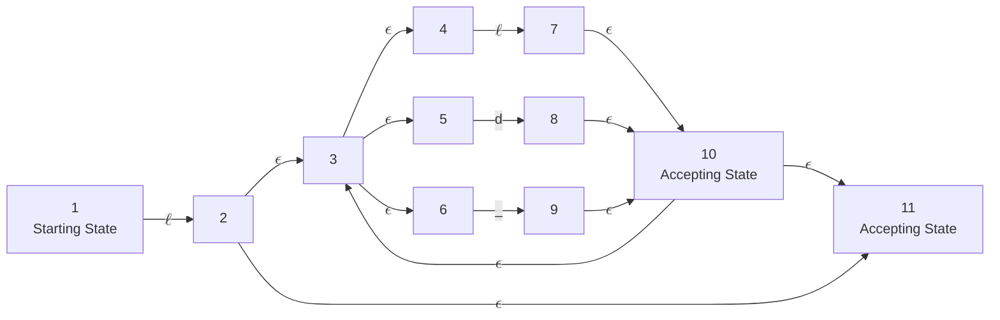

# Lexical Analyzer
## Identifier
### Regular Expression
$$\ell(|\ell|d|\_)^*$$
### Transition Diagram

### $\epsilon$-Closure
- $\epsilon$-Closure(1) = {1}
- $\epsilon$-Closure(2) = {2, 3, 4, 5, 6, 11}
- $\epsilon$-Closure(3) = {3, 4, 5, 6}
- $\epsilon$-Closure(4) = {4}
- $\epsilon$-Closure(5) = {5}
- $\epsilon$-Closure(6) = {6}
- $\epsilon$-Closure(7) = {3, 4, 5, 6, 7, 10, 11}
- $\epsilon$-Closure(8) = {3, 4, 5, 6, 8, 10, 11}
- $\epsilon$-Closure(9) = {3, 4, 5, 6, 9, 10, 11}
- $\epsilon$-Closure(10) = {3, 4, 5, 6, 10, 11}
- $\epsilon$-Closure(11) = {11}
### DFSM
|     |$\ell$|  $d$  |  _  |
|:-----:|:------:|:-----:|:-----:|
|[1] = {1}|[2] = {2, 3, 4, 5, 6, 11}|[]|[]|
|<u>{2, 3, 4, 5, 6, 11}</u>|[7] = {3, 4, 5, 6, 7, 10, 11}|[8] = {3, 4, 5, 6, 8, 10, 11}|[9] = {3, 4, 5, 6, 9, 10, 11}|
|<u>{3, 4, 5, 6, 7, 10, 11}</u>|[7] = {3, 4, 5, 6, 7, 10, 11}|[8] = {3, 4, 5, 6, 8, 10, 11}|[9] = {3, 4, 5, 6, 9, 10, 11}|
|<u>{3, 4, 5, 6, 8, 10, 11}</u>|[7] = {3, 4, 5, 6, 7, 10, 11}|[8] = {3, 4, 5, 6, 8, 10, 11}|[9] = {3, 4, 5, 6, 9, 10, 11}|
|<u>{3, 4, 5, 6, 9, 10, 11}</u>|[7] = {3, 4, 5, 6, 7, 10, 11}|[8] = {3, 4, 5, 6, 8, 10, 11}|[9] = {3, 4, 5, 6, 9, 10, 11}|
|[]|[]|[]|[]

Turns into the identifier transition function

|     |  $\ell$  |  $d$  |  _  |
|:-----:|:-----:|:-----:|:-----:|
|$q_0$ = 1|2|6|6|
|<u>2</u>|3|4|5|
|<u>3</u>|3|4|5|
|<u>4</u>|3|4|5|
|<u>5</u>|3|4|5|
|6|6|6|6|

## Integer
### Regular Expression
$$d^+$$
### Transition Diagram

### $\epsilon$-Closure
- $\epsilon$-Closure(1) = {1}
- $\epsilon$-Closure(2) = {1, 2}
### DFSM
|       |  $d$  |
|:-----:|:-----:|
|[1] = {1}|[2] = {1, 2}|
|{1, 2}|[2] = {1, 2}|

Turns into the integer transition function
|       |  $d$  |
|:-----:|:-----:|
|1|2|
|2|2|

## Real
### Regular Expression
$$d^*.d^+$$
### Transition Diagram

### $\epsilon$-Closure
- $\epsilon$-Closure(1) = {1, 2, 4}
- $\epsilon$-Closure(2) = {2}
- $\epsilon$-Closure(3) = {2, 3, 4}
- $\epsilon$-Closure(4) = {4}
- $\epsilon$-Closure(5) = {5}
- $\epsilon$-Closure(6) = {5, 6}
### DFSM
|     |$d$|  $.$  |
|:-----:|:------:|:-----:|
|[1] = {1, 2, 4}|[3] = {2, 3, 4}|[5] = {5}|
|{2, 3, 4}|[3] = {2, 3, 4}|[5] = {5}|
|{5}|[6] = {5, 6}|[]|
|<u>{5, 6}</u>|[6] = {5, 6}|[]|
|[]|[]|[]|

Turns into the Real transition function

|     |  $\ell$  |  $d$  |
|:-----:|:-----:|:-----:|
|$q_0$ = 1|2|3|
|2|2|3|
|3|4|5|
|<u>4</u>|4|5|
|5|5|5|

