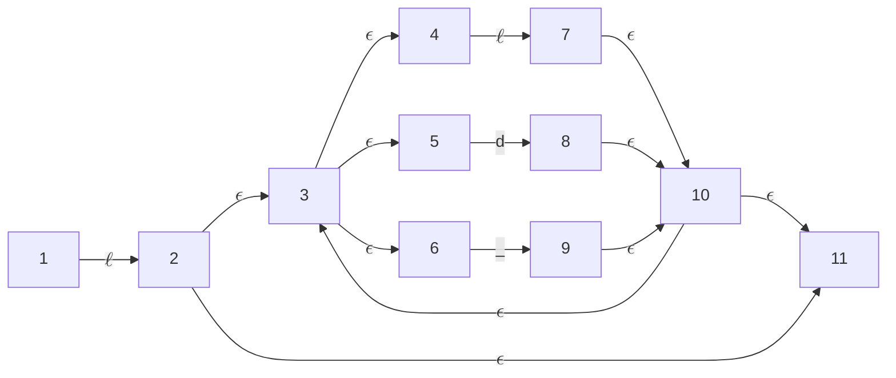

# Lexical Analyzer

## Identifier

### Regular Expression
<b>$$\ell(|\ell|d|\_)*$$</b>

### Transition Diagram

### $\epsilon$-Closure
- $\epsilon$-Closure(1) = {1}
- $\epsilon$-Closure(2) = {2, 3, 4, 5, 6, 11}
- $\epsilon$-Closure(3) = {4, 5, 6}
- $\epsilon$-Closure(4) = {4}
- $\epsilon$-Closure(5) = {5}
- $\epsilon$-Closure(6) = {6}
- $\epsilon$-Closure(7) = {3, 4, 5, 6, 7, 10, 11}
- $\epsilon$-Closure(8) = {3, 4, 5, 6, 8, 10, 11}
- $\epsilon$-Closure(9) = {3, 4, 5, 6, 9, 10, 11}
- $\epsilon$-Closure(10) = {3, 4, 5, 6, 10, 11}
- $\epsilon$-Closure(11) = {11}

### DFSM
|     |$\ell$|  $d$  |  $\_$  |
|-----|:------:|:-----:|:-----:|
|[1] = {1}|[2] = {2, 3, 4, 5, 6, 11}|[]|[]|
|{2, 3, 4, 5, 6, 11}|[7] = {3, 4, 5, 6, 7, 10, 11}|[8] = {3, 4, 5, 6, 8, 10, 11}|[9] = {3, 4, 5, 6, 9, 10, 11}
